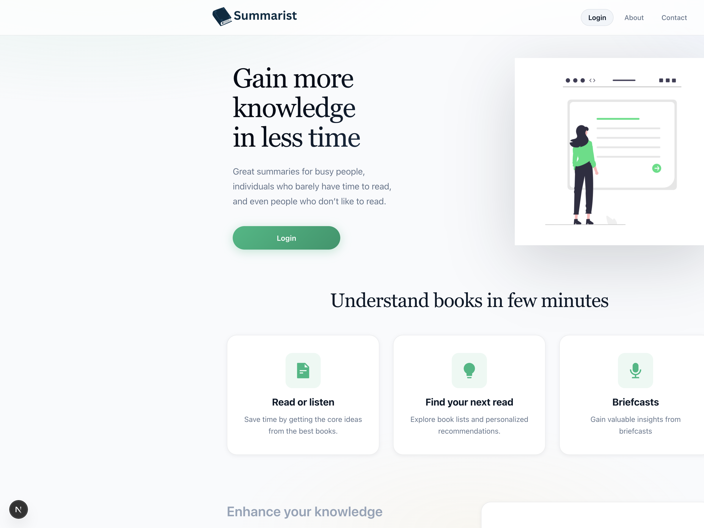

[](https://nextjs.org)
[](https://react.dev)
[](https://www.typescriptlang.org)
[](https://redux-toolkit.js.org)
[](https://firebase.google.com)
[](https://jestjs.io)
[](https://www.cypress.io)
[](https://advanced-virtual-internship-pied.vercel.app)

# Summarist Library

A modern book summary platform inspired by Summarist. Users can browse curated summaries, listen to audio versions, save books to a library, and unlock premium content through a simulated subscription flow.



## Live Demo

https://advanced-virtual-internship-pied.vercel.app

## Features

### Authentication

- Email and password login (custom flow)
- Google sign-in through Firebase
- Guest login
- Persistent sessions via localStorage
- Auth state synced with Firebase without clearing checkout plan selection

### Subscription Flow

- Free trial, Premium, and Premium Plus plans
- Plan selection on `/choose-plan`
- Simulated Stripe-style checkout with card validation (Luhn, expiry, CVC)
- Subscription-aware UI for premium content gating

### Book Experience

- Recommended and suggested book carousels on `/for-you`
- Dynamic book detail pages with read and listen actions
- Audio player with progress saving and adjustable font size
- Save books to a personal library

### UI

- Responsive layout from desktop down to ~320px
- Skeleton loaders for loading states
- Modern CSS design system with glass navigation, gradient accents, and updated checkout styling

## Tech Stack

| Area | Tools |
| --- | --- |
| Frontend | Next.js 16 (App Router), React 19 |
| State | Redux Toolkit |
| Auth | Firebase Auth |
| Styling | Custom CSS |
| Icons | React Icons |
| Testing | Jest, Cypress |
| Deployment | Vercel |

## CI/CD

- **CI**: GitHub Actions runs `npm run build` and `npm test` on every push and pull request to `main`.
- **E2E**: Cypress runs against a production build on every push and pull request to `main`.
- **CD**: Vercel deploys each push to `main`. Firebase keys are stored as Vercel environment variables.

## Getting Started

Clone the repository:

```bash
git clone https://github.com/markwaldron7string/Advanced-Virtual-Internship.git
cd Advanced-Virtual-Internship
```

Install dependencies:

```bash
npm install
```

Create `.env.local` with your Firebase config:

```env
NEXT_PUBLIC_FIREBASE_API_KEY=
NEXT_PUBLIC_FIREBASE_AUTH_DOMAIN=
NEXT_PUBLIC_FIREBASE_PROJECT_ID=
NEXT_PUBLIC_FIREBASE_STORAGE_BUCKET=
NEXT_PUBLIC_FIREBASE_MESSAGING_SENDER_ID=
NEXT_PUBLIC_FIREBASE_APP_ID=
```

Run the development server:

```bash
npm run dev
```

Open http://localhost:3000

## Scripts

| Command | Description |
| --- | --- |
| `npm run dev` | Start the development server |
| `npm run build` | Create a production build |
| `npm run start` | Serve the production build |
| `npm test` | Run Jest unit tests |
| `npm run lint` | Run ESLint |

## Test Payment Info

Checkout uses a simulated payment flow. Use these Stripe test values:

```
Card Number: 4242 4242 4242 4242
Expiration: Any future date (e.g. 04/30)
CVC: Any 3 digits
```

More test cards: https://docs.stripe.com/testing

## Project Structure

```
src/
  app/
    (app)/          # Authenticated app routes (for-you, library, book, player, settings)
    checkout/       # Simulated checkout
    choose-plan/    # Plan selection
    page.tsx        # Marketing homepage
  components/
  context/          # Font size context for the player
  lib/              # Firebase setup
  redux/            # Auth state and persistence
  services/         # Book API helpers and shared types
cypress/e2e/        # End-to-end tests
```

## Author

**Mark Waldron**
